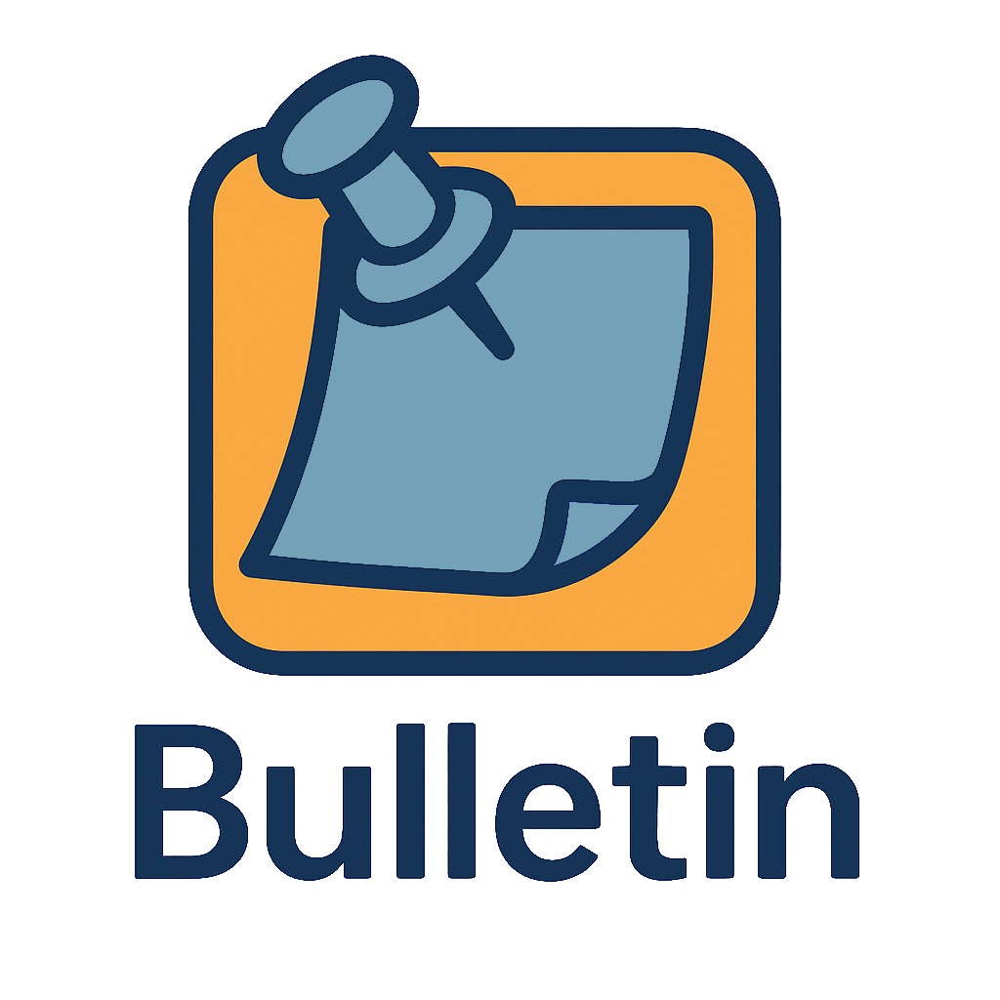

  

# Bulletin 

**Bulletin** is a virtual bulletin board application to help students easily keep track of what's going on on campus. It provides a centralized space where students can view events, follow organizations, and mark attendance while also giving organizations and admins tools to manage events effectively.

## 🎯 Purpose

Keeping track of campus events can be difficult and overwhelming. Bulletin solves this by offering a single platform for:

- Students to discover events
- Organizations to post events
- Admins to moderate content

## 🛠️ Built With

- **Java** and **XML** for Android app development
- **Firebase** for:
  - Real-time Database
  - File Storage
  - Authentication
- **Android Studio** as the development environment

## 👥 User Types

### Organizations
- Post and edit events
- View analytics on followers
- See current, pending, and past events
- Maintain a public profile with an editable description

### Admins
- Approve or reject event submissions
- Monitor and remove events as necessary

### 🎓 Students
- Browse all upcoming campus events
- Follow organizations to receive event updates
- Mark events they plan to attend

## 📽️ Demonstrations

- [Organization Demo](https://docs.google.com/file/d/1dhRkxz8zZa4hTJzeE2mt2mnQNxjdd5eb/preview)
- [Admin Demo](https://docs.google.com/file/d/1jXFD-qAQBYEOqOqv6ceamVdLM6HeyQag/preview)
- [Student Demo](https://docs.google.com/file/d/1hXW21-sfMuHEB-xQg5GZHZuKpWp05vFY/preview)

---
